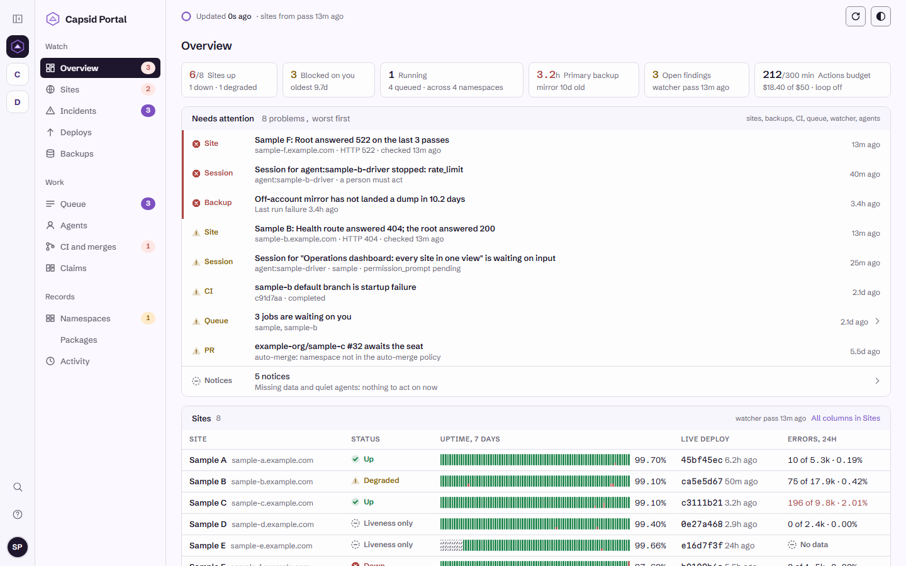
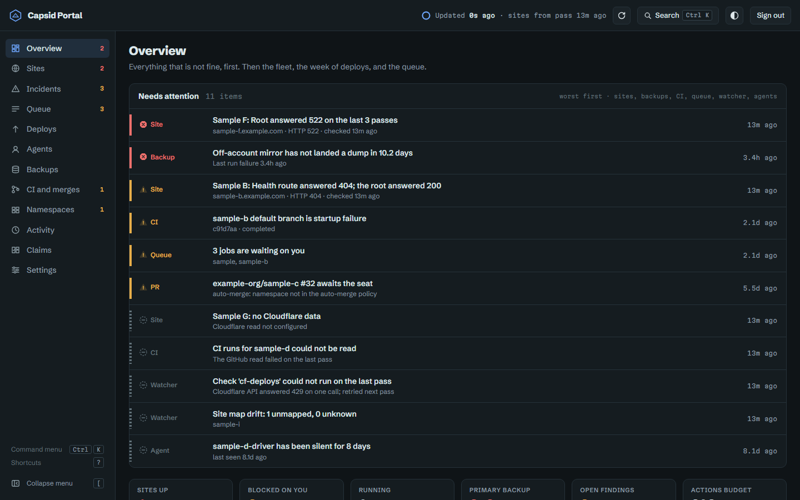
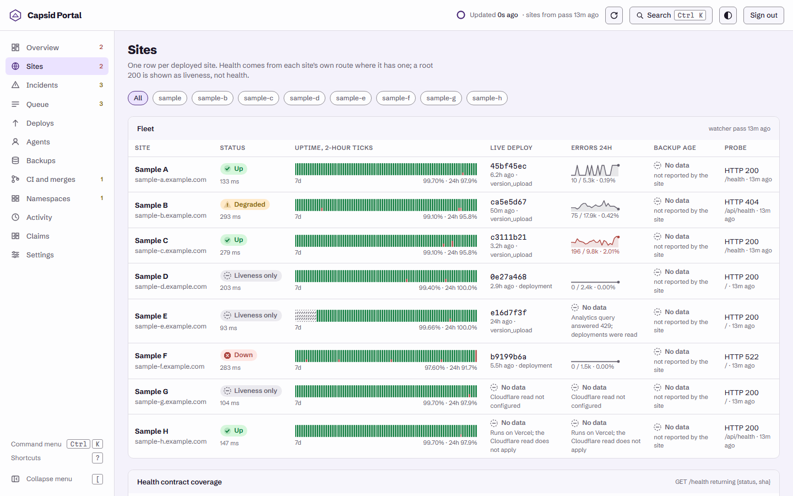
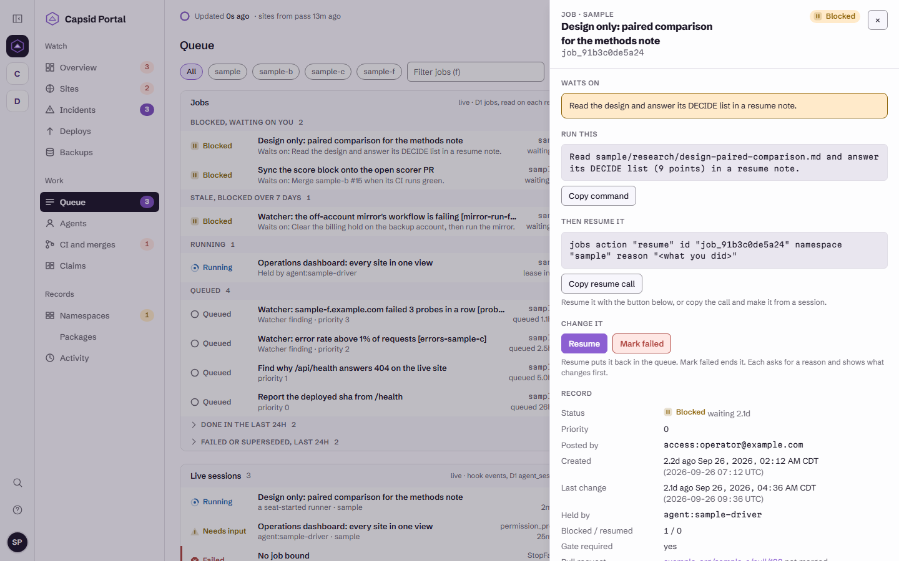
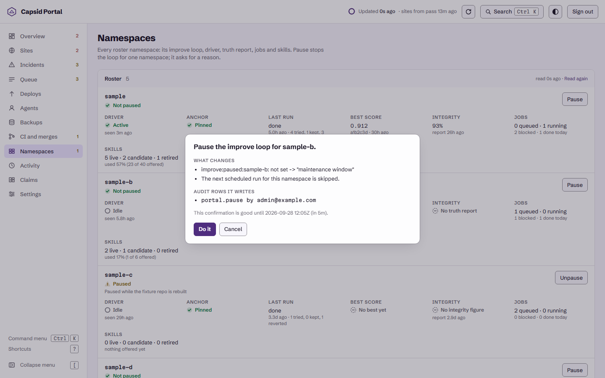
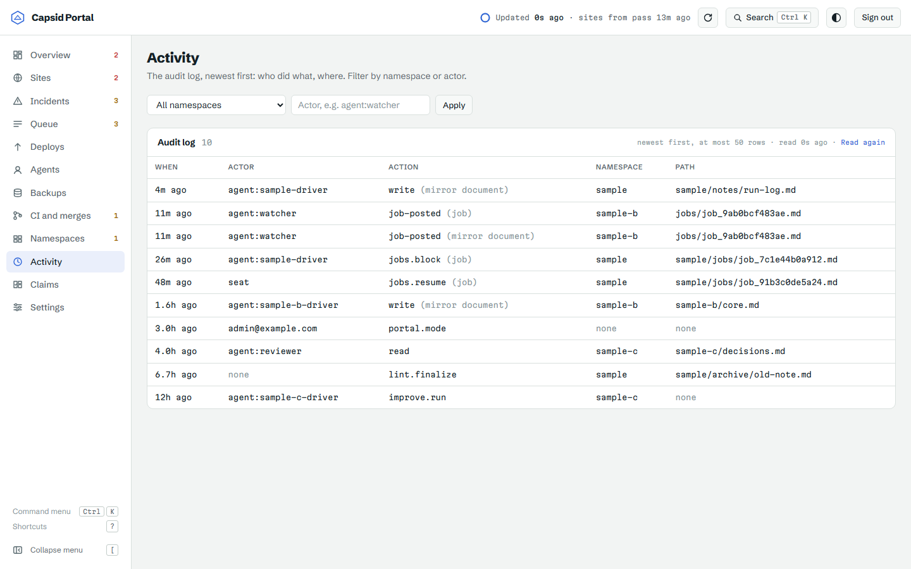
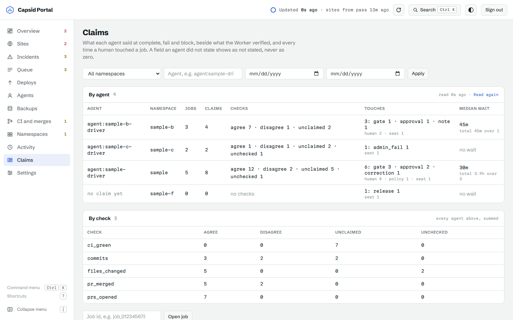
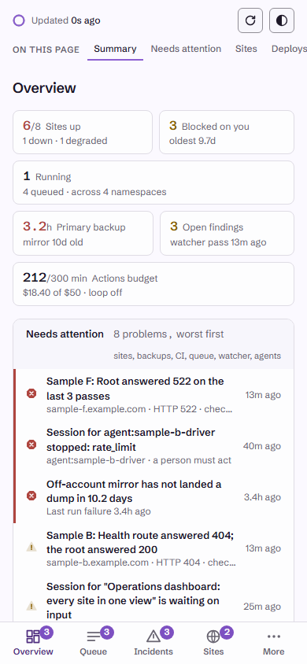

# Capsid

## What Capsid is

Capsid is a single-user Cloudflare Worker that serves a knowledge base over MCP and coordinates AI coding agents working across a set of GitHub repositories. Documents, versions, jobs, agents and the audit log live in D1 (with FTS5 search), backups and the loop's hidden test suites live in R2, and caches and OAuth state live in two separate KV namespaces. On top of that store it runs a signed work queue, issues scoped credentials per namespace and per job, records what an agent claims it did apart from what GitHub confirms, snapshots every overwrite and delete into `document_versions` and appends to `audit_log`, and serves the Capsid Portal, an admin app at `/portal/`. The repository was renamed from `capsid-mcp` to `DrDustinEdwards/capsid` on 2026-09-12; the code names itself by that name in `SELF_REPO`.

## Stack

- Cloudflare Worker (TypeScript), stateless MCP via `createMcpHandler` from the Agents SDK
- [workers-oauth-provider](https://github.com/cloudflare/workers-oauth-provider) wrapping the handler: OAuth 2.1 with PKCE, clients known by their Client ID Metadata Document (no dynamic registration), tokens in KV
- Cloudflare Access for SaaS (OIDC) for the MCP and Capsid Portal logins, locked to one admin email (docs/auth.md)
- A separate GitHub App for repo access, minting short-lived installation tokens
- D1 for documents, versions, namespaces, jobs, agents and the audit log, with FTS5 search
- R2: `MEDIA` for backups, the markdown mirror and CSP reports (the binding name is historical; nothing stores or serves media, and the Worker never reads this bucket back); `HOLDOUT` for the loop's hidden test suites, bound separately so attempt code cannot reach it
- KV, two separate namespaces: `APP_KV` for the Worker's caches, `OAUTH_KV` for the provider's clients, grants and tokens. They must not be the same namespace (see Clone setup)

## How agents connect

Capsid serves MCP over Streamable HTTP on two endpoints. Every caller resolves to an agent, and `checkScope` in `src/scope.ts` is the one place a grant is checked. Detail: [docs/auth.md](docs/auth.md), [docs/bootstrap.md](docs/bootstrap.md), [docs/seat-start.md](docs/seat-start.md).

- **`/mcp`, OAuth, for the single admin.** OAuth 2.1 with PKCE through `workers-oauth-provider`. A client identifies itself only by a Client ID Metadata Document (CIMD): its client id is the URL of a JSON document naming its redirect URIs. There is no dynamic registration endpoint. Sign-in goes upstream to Cloudflare Access for SaaS (OIDC), and the verified email must equal `ADMIN_EMAIL` exactly, a check that runs again on every `/mcp` request.
- **`/ops/mcp`, bearer keys, for agents and cron.** A key is matched by its sha256. Scopes have five axes (namespaces, repos, tools, grants, blast-radius flags), and a new agent gets read on its named namespaces and no flags.
- **Per-namespace driver keys.** `scripts/mint-agents.mjs` mints one driver agent per namespace and writes its key to a local file without printing it. A driver's `repos` axis is set from its namespace's live repo mapping.
- **Per-job runner keys.** A session that the seat starts on GitHub's runners trades its GitHub OIDC token at `/ops/runner-key` for a key bound to one job (`src/runner-key.ts`). The token's claims are checked against the repo's own seat-session workflow, the `seat` environment and a GitHub-hosted runner. The key reaches a short list of tools, works only its own job, stops resolving when that job leaves its live states, and is issued once per start.
- **Protocol version.** The installed `@modelcontextprotocol/sdk` is 1.29.0, whose `LATEST_PROTOCOL_VERSION` is `2025-11-25`, so that is what Capsid negotiates. List results already carry the `ttlMs` and `cacheScope` cache fields from MCP 2026-07-28 (`src/cache-hints.ts`). Under 2025-11-25 they are extra fields that a client may ignore.
- **Tools.** 36 tools. The count is not written down anywhere: `src/counts.ts` derives it from the keys of `TOOL_GRANTS` in `src/scope.ts`, and tests hold that table to the tools actually registered. Every tool in `tools/list` carries all four annotations (`readOnlyHint`, `destructiveHint`, `idempotentHint`, `openWorldHint`) from `src/tool-annotations.ts`. They are hints to the client and enforce nothing.

## The work queue and its gates

A job is a title and a signed body; the body is the prompt a driver runs. The table is the source of truth for status, and every job is mirrored to `<namespace>/jobs/<id>.md` in the same batch as each transition, so `brief` and `search` see the queue. Detail: [docs/work-queue.md](docs/work-queue.md), [docs/autonomy.md](docs/autonomy.md).

- **post.** The body is signed. `claim` verifies it first, and a job edited after signing is marked failed. `post` can require blast-radius flags (`required_flags`), a track record (`min_record`) and a reviewer (`review_required`).
- **claim and heartbeat.** A claim is a four-hour lease, one claim per caller. `heartbeat` extends it, and a five-minute tick returns an expired lease to the queue.
- **block.** A job that reaches a push, a deploy, a secret, a live migration or a merge stops with the exact command a person must run.
- **resume and the gate policy.** `resume` returns a blocked job with a fresh lease. A driver cannot approve its own gate with a plain resume. The signed gate policy defines three classes (`push_branch`, `open_pr`, `additive_migration`). A driver may resume its own job under the policy only when every class matched is a branch push or a pull request. An additive migration stays the seat's to approve, a list of never-approvable commands is checked first, and everything else waits on a person. Two corrections per job, then the admin must decide.
- **review_required.** The driver cannot complete, block or fail a job carrying a pull request until a `REVIEW:` comment posted through Capsid by a `can_comment_pr` holder ends in `APPROVE`, `CHANGES` or `BLOCK`. An `APPROVE` counts only if it quotes the pull request's current head sha.
- **supersede, release and admin fail.** `supersede` ends a job replaced before any work was done and writes no outcome row. `release` returns another credential's claimed job to the queue. The admin or a `can_merge` caller may `fail` a job someone else holds, which writes the holder's outcome row.

## Claims and verified outcomes

Capsid keeps what an agent says apart from what it can check. Detail: [docs/work-queue.md](docs/work-queue.md) ("Claims"), [docs/schema.md](docs/schema.md), [docs/telemetry.md](docs/telemetry.md).

- **`job_outcomes`** is one row per finished job, written once at `complete` or `fail`. Each pull request named in the evidence is read from GitHub, so the merge, commit and file counts are GitHub's, and a per-field `verified` flag says which numbers were checked.
- **`job_claims`** records the driver's own statement (pull requests, tests, deploy state, files touched, self-reported versions) exactly as sent, in the same batch as the transition and before any verification runs.
- **`job_evaluations`** holds one row per check, with the claimed and verified values side by side and whether they agree. The columns follow OpenTelemetry's `gen_ai.evaluation.result` event (`name`, `score_value`, `score_label`, `explanation`).
- **`job_touches`** logs each human or seat touch (gate, resume, approval, correction, release, supersede, seat fail, acted-on review), with how long the job waited where the touch ended a wait.
- **Export.** The admin-only `claims` tool reads one job, aggregates agreement per agent and namespace, or pages a table. `scripts/export-claims.mjs --out <dir>` writes the four tables as JSONL with a hashed manifest, and `--verify <dir>` checks the hashes.
- **Cost.** Claude Code's OpenTelemetry export, received at `/ops/otlp/v1/metrics`, is summed per job onto the outcome row as `cost_usd`, token counts and `active_seconds`.

A field nobody reported is `NULL`, not `0`. That holds for evidence the driver did not give, for a claim field it did not state, and for a cost column whose metric never arrived.

## The improve loop

An optional loop that proposes one scoped change at a time to a roster of repositories, has each repository's own CI score it against a hidden holdout suite, and opens a pull request only when no pinned anchor metric regressed and the weighted secondary score strictly improved. It never merges. It is off by default: `improve_mode` in KV defaults to `off`, and an unset, unreadable or unrecognised value also reads as `off`. The holdout suite is in its own R2 binding. Only `src/improve-scorer.ts` uses that binding, and the environment type handed to attempt code leaves it out. The CI score job reads it with a one-hour, read-only credential. A deterministic path guard keeps attempts off tests, CI and lint config, lockfiles, manifests, migrations, the agent steering layer and the loop's own files. In `subscription` mode the Worker writes a signed task document and a Claude Code session, the driver, runs it under a six-hour per-namespace lease. In `api` mode the Worker calls the model itself. Detail: [docs/improve.md](docs/improve.md).

## The Capsid Portal

The Portal is the administrator's view of Capsid, one app served at `/portal/`, and on its own host when `PORTAL_HOST` in `src/portal-host.ts` names one (this deployment's is portal.dustinedwards.info, where the Portal is the whole host). It signs in through the same Cloudflare Access for SaaS app and the same `ADMIN_EMAIL` check as the MCP login, then keeps a signed twelve-hour cookie. The email check runs again on every request. A request carrying any `Authorization` header gets a 403, so an agent or operator key cannot use it. Detail: [docs/portal.md](docs/portal.md).





The views, in menu order:

- **Overview**: what needs attention, the fleet of sites, deploys and downtime over seven days, the queue and open incidents.
- **Sites**: each configured site, its probe results and a 7-day uptime ring. Shown only while at least one site is configured.
- **Incidents**: the watcher's findings and its last pass.
- **Queue**: every open job and every job that ended in the last day, by namespace, with seat-started sessions and live Claude Code sessions.
- **Deploys**: a deploy timeline per site, read from Cloudflare.
- **Agents**: the roster with each agent's record (last seen, jobs done, failed and blocked, pull requests merged, CI green, median job).
- **Backups**: Capsid's own D1 backup and the off-account mirror.
- **CI and merges**: default-branch CI, pull requests from the last seven days, and what auto-merge left for the seat.
- **Namespaces**: each namespace as `improve_status` reports it.
- **Activity**: the last 50 audit rows, filtered by namespace and actor.
- **Claims**: what each agent said about its work beside what the Worker verified against GitHub, and every human touch of a job.
- **Settings**: the site configuration.











The Portal has fifteen controls (`PORTAL_ACTIONS` in `src/portal-actions.ts`): `pause` and `unpause` a namespace, `reset_breaker` for a namespace's queue, set the improve loop's `mode`, turn the `seat_start` switch on or off, `resume_job`, `fail_job`, `release_job`, `revoke_agent`, `site_add`, `site_edit` and `site_remove`, and `package_add`, `package_edit` and `package_remove`. Each one is two requests. The preview reads current state, writes nothing, and returns what will change, the audit rows the perform will write, and a token signed with a key derived from `COOKIE_ENCRYPTION_KEY`. The token carries the action, its parameters and the admin's email, and expires after five minutes. The perform takes only that token, so what runs is what the dialog showed. A replay inside the five minutes is accepted by the token check; every transition is guarded on the state it moves from, so a second perform is refused or changes nothing. Both requests need the `X-Capsid-CSRF` header to match the `capsid_portal_csrf` cookie and refuse a cross-site `Sec-Fetch-Site`. The Portal cannot merge a pull request or mint a credential, and `test/portal-actions.test.ts` asserts that both are refused.

Optional panels stay hidden until they are configured. Which sites the watcher probes is configuration in the D1 table `ops_sites`, edited in Settings. With no row that has an origin, the watcher probes nothing and reads nothing from Cloudflare, and the Portal hides the Sites view and every site item on the Overview. Deploy and error columns need `CF_OPS_TOKEN`; until it is set they read "Cloudflare read not configured" rather than zero. A value the feed does not have is shown as "No data" with its reason. The Portal works at phone width.



## Security model

**One enforcement point.** Every caller resolves to an agent with its own key, scopes and audit identity. `checkScope` in `src/scope.ts` is the only grant check. The registrar wraps every tool before any handler runs, and `TOOL_GRANTS` states what each tool requires (read, write, per-action, or admin). A tool with no entry requires write, so an omission fails closed. Scopes have five axes: `namespaces`, `repos`, `tools`, `grants` and `flags`. The flags are the blast radius: `can_merge`, `can_direct_write`, `can_dispatch`, `can_write_workflows`, `can_touch_protected`, `money_paths` and `can_comment_pr`. The minted roles each hold at most one of them, and `test/roles.test.ts` fails the build if a role names a second. Two project drivers hold a flag by a recorded exception; the Portal and `improve_status` list what each agent actually holds. Detail: [docs/auth.md](docs/auth.md).

**Admin-only tools.** `register_namespace`, `update_namespace` and `delete_namespace` (the namespace-to-repo mapping is the authorization boundary), `agents` (minting, revoking and re-scoping credentials), `claims`, `ops_snapshot` and `cloudflare_config` require the admin identity, not only the write grant. Some `improve_run` actions are admin only as well, such as signing a policy.

**Repo mutations.** Every write to GitHub goes through `guardedWrite` (`src/tools/repo-guards.ts`). It resolves the repo the call actually reaches, asks `checkScope` about that repo with the flags the call's intent needs, runs the write, and then writes an `audit_log` row. GitHub cannot join a D1 transaction, so if that audit insert fails after the write landed, the result reports the write as done with an `audit_warning` rather than as a failure. `test/blast-radius.test.ts` covers the rule. Detail: [docs/repo-access.md](docs/repo-access.md).

**Snapshots and audit.** Every overwrite and delete of a document snapshots the prior version to `document_versions` and writes `audit_log` (`test/invariants.test.ts`, `test/write-invariants.test.ts`). These tables are not kept forever in D1: after each daily backup, `document_versions` rows older than 90 days and `audit_log` rows older than 180 days are pruned, and they survive only in retained dumps.

**Log redaction.** `ci_status` relays CI log text from GitHub to callers, including drivers. Every log text it returns, and every GitHub error body it echoes, passes through `src/redact.ts` first, which replaces private keys, JWTs, GitHub, Slack and AWS tokens, auth headers, secret-named assignments and high-entropy values with `[REDACTED:<kind>]`. It errs toward over-redacting. A read-only caller gets no log text at all. This applies to relayed CI logs; it is not a filter on everything the Worker logs.

**Seat-started sessions.** The seat can start a Claude Code session on GitHub's runners for one queued job, only on a public repo, only while a switch in KV reads `on` (it ships off). `.github/workflows/seat-session.yml` runs on `repository_dispatch` only. Its guards, in brief ([docs/seat-start.md](docs/seat-start.md) has all of them):

- **Network egress.** `step-security/harden-runner` runs in `block` with an explicit endpoint list recorded from an audit-mode run. Inside the session, Bash runs in Claude Code's sandbox, which is required (`failIfUnavailable`), has no unsandboxed retry, and allows network to `github.com` only (`strictAllowlist`).
- **Per-job keys.** No long-lived runner key exists. The runner trades its GitHub OIDC token at `/ops/runner-key` for a key bound to that one job, pinned to the repo, workflow, ref, `seat` environment and GitHub-hosted runner. The key holds read and write on one namespace and repo, seven tools, and no flags, and is revoked when the job completes, fails or blocks.
- **Never deploy.** The job's `GITHUB_TOKEN` has `contents: write`, no Cloudflare secret is passed, and deploy commands, `wrangler` and `gh` are refused tools. The session opens a pull request and blocks the job for the seat to merge.
- **Hooks off, with a tripwire.** The session runs with `--settings '{"disableAllHooks":true}'`, which outranks a repo's own settings, because repo hooks run outside the sandbox. A local hook of our own is planted after checkout; if it fires, the run fails.
- **Lockdown.** Before the session, a step removes sudo, Docker and containerd and checks they are gone.

**The canary, and what it does not prove.** `test/canary/probe.canary.ts` tries what a hostile test file run through `npm test` would try (reach an arbitrary host, read tokens from the environment or `/proc`, read the Capsid key file, write `.git/config` or `.git/hooks`, use sudo or Docker) and prints only booleans. The weakened control, `.github/workflows/seat-session-canary-weakened.yml`, runs the same probe with no sandbox, no lockdown, harden-runner in audit and fake credentials, and fails unless every exposure reads `true`. That shows the probe can see each exposure, so a `false` in the hardened run is a block rather than a blind spot. What the pair cannot show:

- `oidc_request_in_env` reads `false` in both runs (the weakened job has no id-token permission), so the hardened `false` for it is not evidence the probe could have seen it.
- `github_curl` reads `true` in the hardened run by design: Bash can reach `github.com`, the one host it needs for `git push`.
- It measures only what the probe checks, from inside a Bash command, on one pinned Claude Code version. MCP calls, file tools and WebFetch run outside the Bash sandbox and are bounded by harden-runner, the tool allowlist and the job-bound key, not by the probe's checks.
- It does not test what a session does with the access it is meant to have, such as the content of the pull request it opens.

**Not controllable from Capsid.**

- The admin's own session. The OAuth admin is a synthetic agent with every scope, so a client holding that login on Dustin's machine is not narrowed by `checkScope`, and his own shell can push, deploy or run `wrangler` without going through Capsid at all.
- The legacy operator key, on any deployment where `OPERATOR_KEY_HASH` is still set: a plain entry has the admin grant. This deployment deleted it on 2026-09-12.
- Client-side tool caching. MCP clients cache the tool list at connect time; claude.ai's handling of the cache hints is unknown. A deploy is verified by calling the Worker directly.
- Tool annotations such as `readOnlyHint` are hints to the client and enforce nothing.
- Portal sign-out ends the Portal cookie only. The Access session is Cloudflare's, and a copied cookie stays valid until it expires.
- Hooks and telemetry from a session are reported by that session. A session that sends no key records nothing.

**Audits.** Independent audits of this surface produced these fixes, now in the code: path traversal closed on every document path, OAuth consent bound to the exact redirect it was granted for, the scorer isolated so attempt code never runs beside a credential, protected paths enforced by a deterministic guard, an Origin allowlist on the browser-facing routes, and a replay cache keyed by a database primary key rather than a read-then-write. Two further audits on 2026-09-13, one on the source and one on the test suite, closed four more criticals, each one a check a call path did not reach rather than a rule nobody had written. Each fix ships with a test observed failing against the code it replaced. Private audits live in Capsid. A 2026-09-16 source audit of this Worker is `AUDIT-2026-09-16.md`; it is a snapshot, not canon.

## Backups

A daily cron at 09:00 UTC dumps every D1 table to the `MEDIA` R2 bucket as JSON, using [`@dustinedwards/d1-dump`](https://github.com/DrDustinEdwards/d1-dump), with a markdown mirror of every document body. A run is complete only when its `_complete.json` marker is written last. Retention is by age: runs are kept 90 days, with the 14 most recent complete runs always kept. The private repo `DrDustinEdwards/capsid-backups` mirrors the dumps off-account; this repo only mints that job's credential, and the watcher raises a finding when the newest mirrored dump is older than 36 hours. `restore-rehearsal.yml` runs d1-dump's restore drill on the newest dump every Monday: it restores into a scratch D1 database, checks counts, FTS5 and a search, and deletes it. `wrangler d1 export` of the whole database fails because of the FTS5 table, so restore is per table, `documents` first, never exporting `documents_fts`. D1 Time Travel covers the last 30 days. Detail and the three restore paths: [docs/backups.md](docs/backups.md).

## Install and configuration

A fresh install needs a Cloudflare account and a GitHub App. [docs/bootstrap.md](docs/bootstrap.md) is written for that reader. In short:

1. Create the D1 database, two separate KV namespaces (`APP_KV`, `OAUTH_KV`) and the R2 bucket(s), then copy `wrangler.jsonc.example` to `wrangler.jsonc` (gitignored) and fill in the ids.
2. Apply the migrations with `npx wrangler d1 migrations apply capsid --remote`. The deploy job fails if the live database is behind.
3. Set secrets with `npx wrangler secret put <NAME>`. Required for the logins and repo access: `ACCESS_TEAM_DOMAIN`, `ACCESS_SAAS_CLIENT_ID`, `ACCESS_SAAS_CLIENT_SECRET`, `ADMIN_EMAIL`, `COOKIE_ENCRYPTION_KEY`, `GITHUB_APP_PRIVATE_KEY` (with `GITHUB_APP_CLIENT_ID` as a var). `IMPROVE_SCORE_SECRET` signs jobs and score reports; without it the work queue refuses to post a job. `OPERATOR_KEY_HASH` bootstraps the first agents and is then removed. Optional: `ANTHROPIC_API_KEY` (the loop's api mode), `CF_OPS_TOKEN` and `CF_ACCOUNT_ID` (the Portal's Cloudflare read), and the `R2_*` credential-minting secrets for the holdout and backup mirror.
4. Create a Cloudflare Access for SaaS (OIDC) app with redirect URLs `/callback` and `/portal/callback`, plus `https://<your Portal host>/callback` if the Portal has its own host, limited to your email ([docs/auth.md](docs/auth.md)).

Before a push, run `npm ci --prefix dashboard` once, then `npm run check`, `npm run check:test`, `npm run check:integration`, `npm run check:scripts`, `npm run check:dashboard`, `npm run lint`, `npm test`, `npm run build:dashboard` and `npm run test:browser`. `npm run test:integration` runs the Worker in workerd. `npm run deploy` builds the Portal first and stops if the build or its size budget fails; `EXPECT_SHA=<sha> npm run verify:live` checks the live Worker. `npm --prefix dashboard run dev` serves the Portal with fake sample data.

Optional parts stay hidden or inert until configured. With no row in `ops_sites` that has an origin, nothing is probed and the Sites view is hidden. Without `CF_OPS_TOKEN`, deploy and error columns say the Cloudflare read is not configured. The telemetry receiver (`/ops/otlp/v1/*`, [docs/telemetry.md](docs/telemetry.md)) and the hook receiver (`/ops/hooks`, [docs/hooks.md](docs/hooks.md)) are live but store nothing until a Claude Code session is configured to send to them with a key. The improve loop, auto-merge and the nightly driver are each off by default (see Switches below).

### Full setup, step by step

1. Install dependencies:

   ```
   npm install
   ```

2. Create your own Cloudflare resources:

   ```
   npx wrangler d1 create capsid
   npx wrangler kv namespace create APP_KV
   npx wrangler kv namespace create OAUTH_KV
   npx wrangler r2 bucket create capsid-media
   npx wrangler r2 bucket create capsid-improve-holdout   # only if you run the self-improvement loop
   ```

3. Copy the config template and fill in your IDs from step 2. **`APP_KV` and `OAUTH_KV` must be different namespace ids.**

   ```
   cp wrangler.jsonc.example wrangler.jsonc
   ```

   The real `wrangler.jsonc` is gitignored. Never commit it.

4. Apply the migrations (idempotent, `IF NOT EXISTS` everywhere):

   ```
   npx wrangler d1 migrations apply capsid --remote
   ```

5. Generate an operator key and store its sha256 hash as a secret. Keep the raw key safe; headless clients send it as the bearer token on `/ops/mcp`:

   ```
   npx wrangler secret put OPERATOR_KEY_HASH
   ```

   The value is one or more comma-separated lowercase hex sha256 hashes. Prefix an entry with `ro:` to make that key read-only, for example `<full-key-hash>,ro:<agent-key-hash>`. Never store a raw key in the repo. Once agents are minted (`docs/bootstrap.md`), remove the operator hash. Minting another agent after that needs the hash set again for the length of one command, because `scripts/mint-agents.mjs` authenticates with `CAPSID_OPERATOR_KEY` and nothing else. `docs/bootstrap.md` carries that sequence under "Minting once no operator key exists".

6. Create a Cloudflare Access for SaaS application (for login) in the Zero Trust dashboard: Access, Applications, Add an application, SaaS, OIDC.

   - Redirect URLs, both of them, spelled exactly: `https://capsid.<your-subdomain>.workers.dev/callback` for the MCP flow and `https://capsid.<your-subdomain>.workers.dev/portal/callback` for Capsid Portal.
   - Scopes openid, email and profile, PKCE on, and a policy that allows your email only.

   Then set the secrets:

   ```
   npx wrangler secret put ACCESS_TEAM_DOMAIN          # https://<team>.cloudflareaccess.com
   npx wrangler secret put ACCESS_SAAS_CLIENT_ID
   npx wrangler secret put ACCESS_SAAS_CLIENT_SECRET
   npx wrangler secret put ADMIN_EMAIL                 # the one email both logins admit, exactly
   npx wrangler secret put COOKIE_ENCRYPTION_KEY       # openssl rand -hex 32
   ```

7. For repo access, create a GitHub **App**. Permissions: Repository contents read and write, Pull requests read and write, Metadata read, Actions read and write, Workflows write (confirmed by probe 2026-09-07: a pull request authoring a workflow file succeeded, and was closed immediately; that probe proves write and says nothing about read, so read is not claimed here). The last two are what let the Worker dispatch a workflow and write under `.github/workflows/`; both are gated behind agent flags (`can_dispatch` and `can_write_workflows`), so the App holding the permission does not mean a caller can use it. Install it on the repositories you want reachable. Note its Client ID, generate a private key (`.pem`), then:

   ```
   # put the App client id in wrangler.jsonc vars as GITHUB_APP_CLIENT_ID
   npx wrangler secret put GITHUB_APP_PRIVATE_KEY        # paste the .pem contents
   ```

   Only the private key mints installation tokens; the App client secret is not needed. The installation id is not configured: it resolves from GitHub per owner and repo and is cached for a day, because one pinned id cannot be correct for two owners.

   Optional, only for the self-improvement loop: `IMPROVE_SCORE_SECRET` (the root of the per-repo score-report keys) and, for `api` mode, `ANTHROPIC_API_KEY`. The loop stays off until `improve_mode` is set.

   ```
   npx wrangler secret put IMPROVE_SCORE_SECRET
   npx wrangler secret put ANTHROPIC_API_KEY        # api mode only
   ```

8. Type check and deploy:

   ```
   npm run check
   npm run deploy
   ```

9. Connect claude.ai: Settings, Connectors, Add custom connector, URL `https://capsid.<your-subdomain>.workers.dev/mcp`. The connector registers itself and walks you through the Cloudflare Access sign-in. Only the `ADMIN_EMAIL` identity gets in (docs/auth.md).

   Or test the flow first with the MCP Inspector:

   ```
   npx @modelcontextprotocol/inspector
   ```

   Set transport to Streamable HTTP, URL to `https://capsid.<your-subdomain>.workers.dev/mcp`, open the Auth tab, and run Quick OAuth Flow.

MCP clients cache the tool list at connect time. After deploying new tools, reconnect the connector or start a new chat to see them.

### Switches

Three switches, all off by default. Each is turned on separately.

The loop runs only when `improve_mode` in `APP_KV` is set to `subscription` or `api`, by `improve_run` action `mode`. Anything unreadable or unexpected falls back to `off`.

Auto-merge and pre-approved gates run only when their policy document's `enabled` field is `true` and the document has been signed again afterwards with `improve_run` action `sign_policy`, which is admin only. Editing without re-signing leaves the policy authorizing nothing.

The nightly driver exists only after `node scripts/schedule-drivers.mjs --install --namespace <ns> --apply`. The task it creates is disabled until it is enabled by hand.

Those are a clone's defaults. On this deployment the pre-approved gates were enabled on 2026-09-13 and auto-merge on 2026-09-16; the loop is still off.

## Endpoints

- `POST /mcp` MCP over Streamable HTTP, requires an OAuth access token (admin only)
- `POST /ops/mcp` MCP over Streamable HTTP for agents and cron, requires an agent or operator key as `Authorization: Bearer <key>`
- `POST /ops/otlp/v1/metrics`, `POST /ops/otlp/v1/logs` Claude Code's OpenTelemetry as OTLP/HTTP JSON, gzip or plain, at most 1MB. A driver key, a runner key or the admin key as `Authorization: Bearer <key>` (401 without one, 403 for a read-only key). Keeps usage totals per session and a count of api_error events; never a prompt, a response or tool content (docs/telemetry.md)
- `POST /ops/hooks` Claude Code HTTP hook events, requires a driver or runner key as `Authorization: Bearer <key>`; keeps a summary of each session, never a prompt, response or tool content (docs/hooks.md)
- `POST /ops/backup` runs a backup on demand, requires the admin (a write-grant operator key; a minted agent gets 403), returns a JSON summary
- `GET /authorize`, `POST /authorize`, `GET /callback` the MCP sign-in, through Cloudflare Access for SaaS
- `GET /portal/`, `GET /portal/callback`, `GET /portal/api/ops`, `POST /portal/api/ops/refresh`, `POST /portal/api/actions/preview`, `POST /portal/api/actions/perform`, `GET /portal/api/namespaces`, `GET /portal/api/activity`, `GET /portal/api/claims`, `GET /portal/api/packages/history`, `POST /portal/api/sign-out` Capsid Portal: the app's files, its sign-in return, its feed, an on-demand watcher pass (header `X-Capsid-Ops: refresh`, once per two minutes), the fifteen controls as a preview and a perform (header `X-Capsid-CSRF`), the namespaces, activity, claims and package history reads, and sign out. Admin session only; a bearer token is refused with 403 (docs/portal.md). Nothing answers under `/console`
- `POST /csp-report` no auth. Content-Security-Policy and COOP violation reports, per-IP rate limited, and refused with a 503 when the limiter cannot read its counters
- `POST /improve/score` the signed score report a roster repo's CI posts back
- `POST /improve/holdout-credential` mints the one-hour, object-read-only credential the score job reads the holdout suite with
- `POST /backup/credential` mints the credential the off-account backup writes with
- `POST /token` token exchange (served by the library). There is no `/register`: a client's id is the URL of its metadata document (CIMD)
- `GET /.well-known/oauth-authorization-server` and `GET /.well-known/oauth-protected-resource` discovery metadata (served by the library)
- `GET /health` no auth. Reports deploy provenance (git sha, whether the tree was dirty, build time) and probes the store: `SELECT 1` against D1 plus an FTS5 MATCH pinned to one known document. Either probe failing returns 503 with `status: "degraded"` and a `store` object naming which one. A Worker whose bindings resolved to nothing starts normally and would otherwise answer `ok` while every read tool errors.

## Documentation

- [docs/auth.md](docs/auth.md) the agent model, the five scope axes, the roles, the two gated endpoints, and the tool hints and list cache fields clients receive
- [docs/repo-access.md](docs/repo-access.md) how the GitHub App token flow works and which tools read and write repos
- [docs/seat-start.md](docs/seat-start.md) how the seat starts a Claude Code session on GitHub's runners for a queued job, and its guards
- [docs/telemetry.md](docs/telemetry.md) Claude Code's OpenTelemetry into Capsid: per-session usage, per-job cost on the outcome row, and the settings that turn it on
- [docs/work-queue.md](docs/work-queue.md) the job lifecycle, signing, leases, gates, evidence and agent records
- [docs/autonomy.md](docs/autonomy.md) auto-merge, pre-approved gate classes, the nightly driver and the watcher
- [docs/improve.md](docs/improve.md) the self-improvement loop: how it runs, and what stops it moving its own goalposts
- [docs/skills.md](docs/skills.md) how an idea abstracted from work that landed is offered to other projects
- [docs/portal.md](docs/portal.md) Capsid Portal: its views and data, what "no data" means, who gets in, its routes and controls, the Cloudflare token, and building it
- [docs/consolidation.md](docs/consolidation.md) the wiki maintenance loop, and the confirmation step on destructive writes
- [docs/backups.md](docs/backups.md) what the daily dump contains, and three restore paths in the order to try them
- [docs/rollback.md](docs/rollback.md) serving the previous Worker version when a deploy shipped a bad one
- [docs/schema.md](docs/schema.md) the knowledge model, the document types and the tables
- [docs/bootstrap.md](docs/bootstrap.md) minting agents and removing the operator key
- [docs/hooks.md](docs/hooks.md) Claude Code session hooks: what `/ops/hooks` keeps, who may post, the settings for driver repos and Dustin's machine, and what enabling them for seat-started sessions would take
- [docs/live-checks.md](docs/live-checks.md) The watcher's live checks: a site's deployed sha against its default branch, and the Web Analytics beacon and CSP on named pages, from a document in the store
- [docs/overnight.md](docs/overnight.md) The overnight run: the plan per repo, the morning digest, and the scheduler switch with its Runs on choice (API key or subscription, the subscription decision recorded with it)

## What Capsid is not

- **Not multi-user.** It admits one identity, `ADMIN_EMAIL`, for both logins. Agents are credentials that person mints, not other users.
- **Not a hosted service.** Each install is its own Worker on its own Cloudflare account. The deployment this repo runs is for its author.
- **Not a general agent framework.** It stores memory, issues scoped keys, runs a job queue and relays GitHub operations through a GitHub App. It does not run models itself except in the optional loop's api mode.
- **Not a replacement for code review.** Drivers open pull requests and never merge them. Merges are made by the seat, or, for namespaces a signed auto-merge policy lists, by the Worker when that policy's checks pass. capsid's own pull requests are never auto-merged. CI and the hidden holdout tests measure changes; they do not review intent.
- **The improve loop does not merge,** does not edit tests, CI or its own scoring, and does not touch a project that is not on the roster ([docs/improve.md](docs/improve.md)).
- **The Portal does not merge or mint.**
- **Not listed in an MCP directory.** It has not been submitted to any MCP directory or registry.

## Status and licence

MIT ([LICENSE](LICENSE)). Maintained by one person, Dustin Edwards. A push or merge to `master` deploys to production, docs included, so every merge to `master` is a deploy.

What's next: The experiment scheduler, once the loop has real nights behind it. Nothing else is planned.
